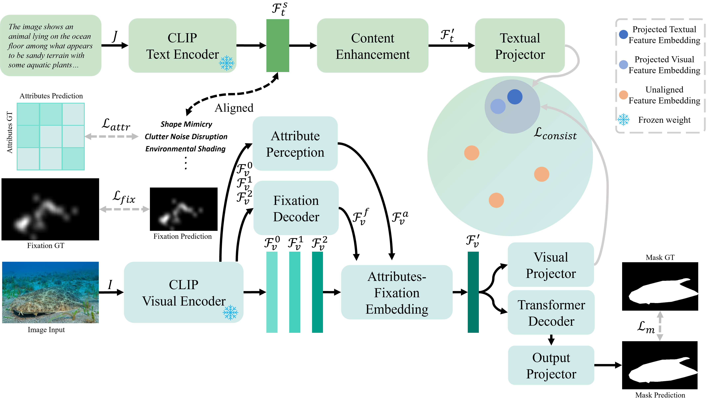

#  Unlocking Attributes' Contribution to Successful Camouflage: A Combined Textual and Visual Analysis Strategy

## News 
[2024-07-01] Our work is accepted by ECCV 2024! Congratulations and see you in Milano! :laughing:  
[2024-03-15] First commit.

## COD-TAX Overview
We introduced COD-TAX, which provides textual descriptions and attribute contribution information to COD. The textual descriptions focus on characterizing the entire COD scenario, while the attribute contributions primarily reveal the proportions in which various attributes influence the current scene. These components are initially generated by GPT-4 and subsequently fine-tuned by human. COD-TAX could be found in [COD-TAX](https://drive.google.com/file/d/1489Q627rHZFFkOMaXU-6did6rOBEexRM/view?usp=sharing).

      
    <em> 
    Visualization of the overall distribution of the COD-TAX dataset. (a) illustrates the 17 attribute classes within three primary categories: Surrounding Factors (SF), Camouflaged Object-Self Factors (COF), and Imaging Quality Factors (IQF). The proportion of each attribute represents its average contribution to the general COD scenario, while 'Max' reveals the maximum proportion it occurred in the training dataset. (b) shows the statistical results of textual description lengths. (c) presents a word cloud map illustrating word frequency. (d) shows two examples from the COD-TAX dataset.
    </em>

The number in COD-TAX/attribute_contribution contains 17 normalized contribution to current camouflaged scene. The attribute is orderd in: 

**Surrounding Factors:** Environmental Pattern Matching, Clutter Noise Disruption, Environmental Motion Dazzle, Environmental Shading, Environmental Textures.

**Camouflaged Object-Self Reasons:** Color Matching, Shape Mimicry, Behavior Mimicry, Texture Adapting, Shadow Minimization, Edge Diffusion.

**Imaging Quality Reasons:** Blur Issue, Low Resolution, Improper Exposure, Compression Artifacts, Object Size Matters, Object Placement.

For detailed explaination and example, please refer to the supplemental material.

## ACUMEN Overview

      
    <em> 
    Overall structure of the proposed ACUMEN. The model utilizes both a textual
branch and a visual branch, with the textual branch active only during training for practical usage.
    </em>

## Experiment Results

      
    <em> 
    Qualitative results.
    </em>

      
    <em> 
    Quantitative results.
    </em>

## Experiment Setting

install dependencies in *requirements.txt*
torch1.9 + cuda10.2 is recomanded

ACUMEN reuslts for _CAMO_, _COD10K_, and _NC4K_ can be found in [ACUMEN results](https://drive.google.com/file/d/1Xywb2vvgiIR8SjSV-guWswSCNsLVvFnF/view?usp=sharing).

Manage the traning and testing dataset like this, Desc is provided by [COD-TAX](https://drive.google.com/file/d/1489Q627rHZFFkOMaXU-6did6rOBEexRM/view?usp=sharing) and fixation information can be found from [COD-Rank-Localize-and-Segment](https://github.com/JingZhang617/COD-Rank-Localize-and-Segment). For reproduction convenience, we provide the all in one data [Data_all_in_one](https://drive.google.com/file/d/1T_-zg3DKt-i27nDqBmhtiyANNdFz07jG/view?usp=sharing).
    
    ACUMEN
        --dataset
            --TestDataset
                --CAMO
                --CHAMELEON
                --COD10K
                --NC4k
            --TrainDataset
                --Desc
                    --overall_description
                    --attribute_description
                    --attribute_contribution
                --Imgs
                --Fix
                --GT
          

put pretrained `ViT-L-14-336px.pt` here. [pretrained ViT](https://drive.google.com/file/d/1Wm9_Dl6M5ETR9qZod3CwWEToMCfDotjg/view?usp=sharing).

    ACUMEN
        --pretrain
            ViT-L-14-336px.pt

## Training
For the training process, run:

    python train_multigpu_noattr.py --config config/codclip_vit_L14@336_noattr_3_1_50.yaml

## Testing / Inference
Put the pretrained checkpoint [here](https://drive.google.com/file/d/1lBMEbeST62KIq4MtJnI9hq19krae0Nxw/view?usp=sharing).

    ACUMEN
        --exp/metapara_noattr_3_1_50
            Net_epoch_best.pth

And run:

    python test.py --config config/codclip_vit_L14@336_noattr_3_1_50.yaml